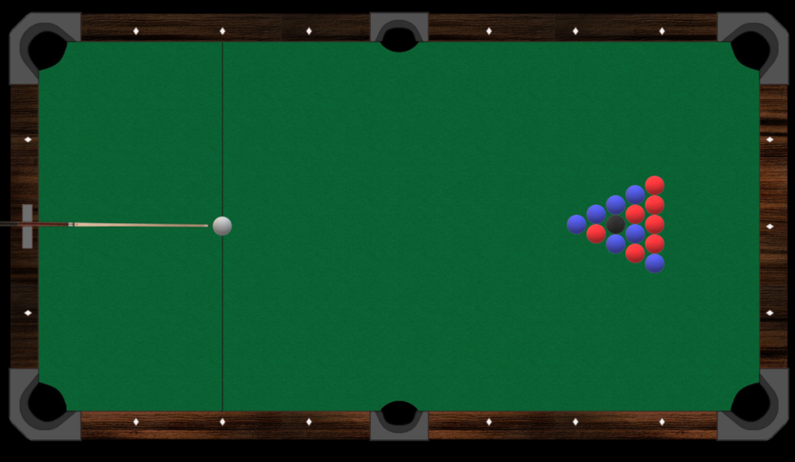

# Software Studio 2019 Summer Final Project

</img>

## 8 Ball Pool
### By 張子宜、林意清、洪若淮
* Key functions
    1. hitting the ball
    2. controlling the force and the direction of the pole
    3. collision
    4. checking the ball is potted(goal)
    5. checking whose turn it is
    6. check if game is over
    7. determine winner

## Basic Components
* state transition
* text animation
* restart button (sprite when hover)
* audio playing

# 作品網址：https://106062301.gitlab.io/8ballpool
